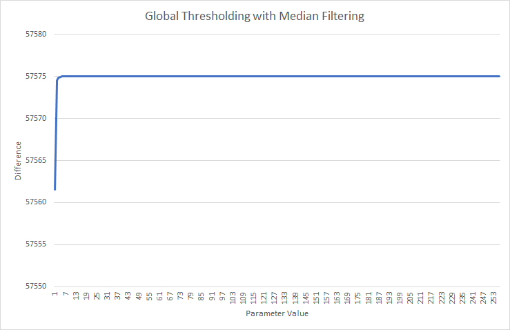
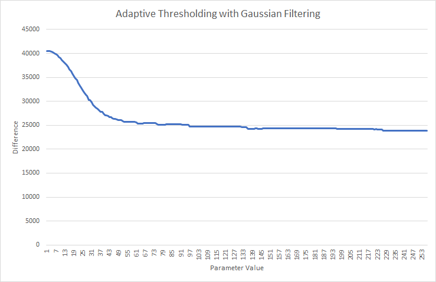

## Filtering + Thresholding
The goal of this method was to find a filtering and thresholding method which perform relatively well​. Due to the basic method, a high score was not expected, but instead the aim was to provide a baseline to compare other segmentation methods against. Median and gaussian filtering were used in combination with global, otsu and adaptive thresholding.

### Method
To determine the best comination of filtering and thresholding, we tested various parameters of both, median and gaussian filtering in combination with one of the thresholding methods. The number of incorrectly classified pixels were counted per image and averaged across the 24 test images used. This is to provide a preliminary quantative measure of performance. After determining the best combination, the method was scored on its performance in the final 6 images.

### Results

#### Global Thresholding
  

Global thresholding seemed adversely affected by both, gaussian and median filtering, performing worse with increased parameters. Upon inspecting the result of thresholding, the reason became evident; the global thresholding function thresholded almost everything to white. Some images had pixels thresholded to black, but when a filter was applied, decreased the darkness of the pixel which resulted in a reclassification to white.

#### Adaptive Thresholding
  

The graphs for adaptive thresholding suggest reduced error the larger the filtering parameter. Median filtering provided a smoother curve than gaussian, but gaussian performed better overall.

However, the output was visually undesirable, with no detail being able to be made out from it. A vast majority of pixels were classified as membrane which is clearly incorrect

Inspecting the output of a lower filtering parameter, the reason adaptive thresholding is inappropriate for this situation becomes clear. While it is able to corretly segmentate the cell membranes with high accuracy, it also incorrectly segmentates parts of the cells as membranes themselves. Filtering with a larger kernal resulted in adverse performance as it caused even more incorrect thresholding resulting in the output image shown previously.

#### Otsu Thresholding
  

Otsu filtering resulted in two different graphs for gaussian and median filtering unlike previous thresholding techniques. Gaussian filtering showed a clear global minimum early on. Median filtering initially showed a similar shape and range, but then deviated, demostrating less fluctuations as it moved downwards to a late global minimum.

The global minimum with the otsu thresholding and gaussian filtering combination showed a satisfactory result. While the segmentated cell membranes were quite thick, they followed the correct shape and pattern. Cell nuclei were incorrectly segmentated as a result of the limiatation of this technique.

The global minimum for otsu thresholding and median filtering reveal a poorly segmentated image. While there may be numically less errors in this image, all the details of cell membranes have been lost from the high filtering parameter.

The first local minimum for otsu thresholding and median filtering shows more promise. Similar to the gaussian combination, the shape and pattern of cell membrane was evident, and a little less thicker than gaussian filtering. However, there was more noise in the cells and the nuclei were again, incorrectly segmentated.

### Conclusion

The two best combinations found were otsu thresholding with gausian filtering with kernal size 31, and otsu thresholding with median filtering with kernal size 11. Otsu thresholding with median filtering with kernal size 11 was ultimately chosen as the thinner cell walls were more desirable and showed a better representation of the membranes than the former method.

The results of this method were:

 Image​   | Random Score​        | Information Score
:--------|--------------------:|--------------------:
 24​      | 0.04135279479175265​ | 0.28777568458875163​
 25​      | 0.07134981833970301​ | 0.331073021483818​
 26​      | 0.15694812953483503​ | 0.4328144376212064​
 27​      | 0.06254107252415468​ | 0.41746502899092336​
 28​      | 0.03684109712237082​ | 0.26002132996516425​
 29​      | 0.0826001704915761​  | 0.16626235525179023​
 Average​ | 0.0752721804673987​  | 0.315901976316942​

Evidently, Random performance was extremely poor, with only one image being able to achieve more than 0.1. Information performance fared better. These results were not unexpected, given the simple algorithm used for this method.

## Random Forest
A Random Forest Classifier was used to attempt to classify pixels. The goal was to have a simple, yet effective method to segment cell membranes. A random forest classifier was chosen to perform this due to the ease at which it can be trained and executed.

### Method

#### Training
A random forest classifier was trained with the inputs being a vectorised form of the intensities of a 20x20 square of pixels extracted from a section of the given image. The truth given to this vector corresponded to the centre of the ground truth image, being either a cell (0) or membrane (1).

The classifier was trained on 100 random samples from each of the 24 training images.

#### Execution
The random forest classifier was executed on each pixel of a new given input iamge to provide the probability of being a membrane. Reflection padding was used to expand the border of the image in order to execute properly on the edge pixels.

#### Post-Processing
In order to perform post-processing, the [0.0-1.0] probabilities were converted to regular pixel intensities [0-256]. Median filtering with size 11 was then performed across the image in order to smooth these probabilities. This was done to reduce the impact of a stray cell-classified pixel surrounded by membrane-classified pixels and vice versa. Contrast streching was then performed to have a higher dynamic range of probabilities to threshold on.

### Results

Image    | Rand Score         | threshold | Information Score   | threshold | Best Score
--------:|-------------------:|----------:|--------------------:|----------:|-------------------:
 24      | 0.6664380508717962 | 0.000     | 0.34572115254045604 | 0.900     | 0.6664380508717962
 25      | 0.5521870115200735 | 0.300     | 0.3885467098170553  | 0.900     | 0.5521870115200735
 26      | 0.3933617592929107 | 1.000     | 0.5153258714830867  | 0.800     | 0.5153258714830867
 27      | 0.4026412310463936 | 0.200     | 0.4903014810597193  | 0.900     | 0.4903014810597193
 28      | 0.757316026587714  | 0.000     | 0.29865942271314405 | 0.800     | 0.757316026587714
 29      | 0.9002088980410359 | 0.400     | 0.21521857517572676 | 0.500     | 0.9002088980410359
 Average | 0.612025496226653  | -         | 0.375628868798198   | -         | 0.646962889927237

### Conclusion
Random forest performed surprising well. While information performance was similar to thresholding, random performance was much better. Random forest was able to classify many of the membrane patterns and able to ignore some cell nuclei.

